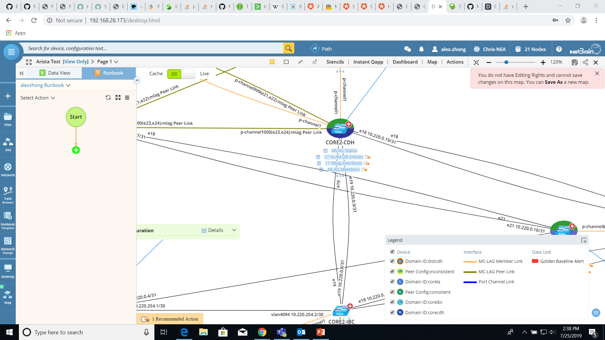
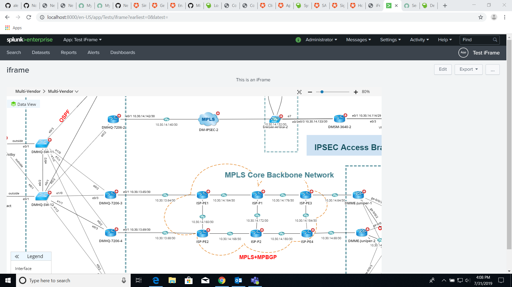
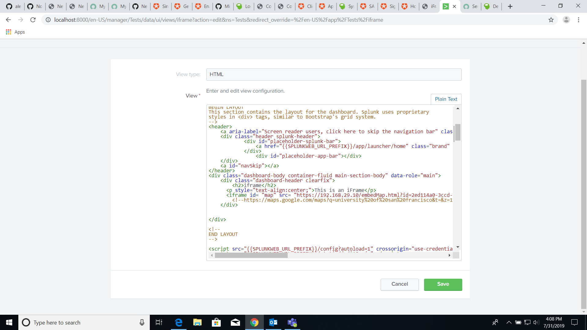

# EmbedMap Implementation in External Domain
NetBrain EmbedMap is a limited view of a regular NetBrain Map that we are using to integrate into third party software. EmbedMap only shows the map itself along with the detailed information within the visualization and the data View. There are several important use cases for EmbedMap. One use case is for low level IT staff who have little experience; EmbedMap allows for them to see the map without being overwhelmed by all the information a regular map provides. In addition, EmbedMap should be implemented so that the low experience engineers can see the map without needing credentials for their NetBrain account. Another important use case is for Just-In-Time information. We can have gather information right at the time of a network incident and display a map using EmbedMap. During the current use case, we are going to embed NetBrain map into external webpages/domains by generating an embedMap URL and set it as the source URL of an iFrame. 
<br>
<br>
**Embed Map**

<br>
**Full Map**

*Note*: Only data view and the actual map are shown in the EmbedMap and other functions such as Runbooks are absent
<br>
<br>

**iFrame information:**
iFrames are HTML tags that embeds another HTML page into the current one. Browsers keep the context of the iframe and its parent document totally separate by default. Neither the parent document nor the iframe document has access to each other's DOM, CSS styles, or JavaScript functions if they're not from the same domain. Each embedded browsing context has its own session history and document. Neither the iframe nor its parent can access the other's cookies or local storage. Given that iFrames are html tags, we can only implement iFrames in third-party software if they allow us to add html to their domain/website. Also, since we must generate an EmbedMap URL dynamically and use RESTful API calls to retrieve NetBrain information, the third party software must also allow these functionalities.
<br>
<br>

## Appendix
>[ServiceNow Implementation](#embedmap-in-servicenow) <br>
>[Splunk Implementation](#embedmap-in-splunk) <br>
>[PRTG Implementation](#embedmap-in-prtg) <br>
<br>
<br>

**[Step 1: Use case preparation](Step-1:-Use-case-preparation)**
>> 1a. Enable https on Netbrain client server<br>
>> 1b. Add external domain to Content Security Policy tag in web.config file of client server<br>

**[Step 2: Embedding Map](Step-2:-Embedding-Map)**
>> 2a. Generate URL using Netbrain RESTful API<br>
>> 2b. Input generated URL into src attribute of iFrame tag<br>

## Step 1: Use case preparation
***1a. Enable https on Netbrain client server***
> https with a proper security certificate must be enabled on the Netbrain server in order for the embedMap to display properly. This is because http content will not display on an external site with https due to many browsers' Mixed-Content policies. 
<br>
Resources on enabled https: [Enable HTTPS on NetBrain Server](https://ftp.netbraintech.com/netbrain-support/ProblemDetail.php?problemid=591)

***1b. Add desired external domain to Content Security Policy tag in web.config file of client server***
> The Content Security Policy tag is a security policy tag contained in the web.config file of our NetBrain web servers. Only the domains included within this tag are allowed to display EmbedMap inside of an iFrame. Domains not included in this tag will not be able to display the embedMap. (Use frame-ancestors keyword)
> In this example, the domain "https://dev85857.service-now.com/" is included within the tag. This will allow that particular domain to display a NetBrain EmbedMap inside of an iFrame on their website. However, another domain, such as a PRTG or Splunk domain, will not be able to display NetBrain content in an iFrame since their domains are not included in the tags. 
> Note: Content Secuirty Policy might not be supported by some of the older versions of browsers, which may be the cause of an error.
> Note: This security policy is set on NETBRAIN SERVERS. This does not have anything to do with the external domain. 

```html
<!-- Add domain to Content-Security-Policy -->
<remove name="X-Frame-Options" />
<remove name="X-Content-Type-Options" />
<remove name="X-XSS-Protection" />
<remove name="Strict-Transport-Security" />

<add name="X-Frame-Options" value="SAMEORIGIN" />
<add name="X-Content-Type-Options" value="nosniff" />
<add name="X-XSS-Protection" value="1; mode=block" />
<add name="Strict-Transport-Security" value="max-age=31536000; includeSubDomains; preload" />
<add name="Content-Security-Policy" value="frame-ancestors https://192.168.29.10:8080 https://dev85857.service-now.com/"/>
```
Note that the only line that needs to be altered is the last line with the tag "Content-Security-Policy". All other lines are related, but should be left alone.
<br>
For example, if we wanted to display an embedmap on Google, we would append Google's domain in the following way.
```html
<add name="Content-Security-Policy" value="frame-ancestors https://192.168.29.10:8080 https://dev85857.service-now.com/ https://www.google.com"/>
```

## Step 2: Embedding Map
***2a. Generate URL using Netbrain RESTful API***
>The embedMap URL is in the format "https:// IP address /embedMap.html" with 5 query parameters: id (mapId), t (tenant), d (domain), maptype (int), newEmptyMap (boolean). newEmptyMap is not a necessary query parameter. 
Ex. https://192.168.29.10/embedMap.html?id=2ed114a0-3ccd-e0ba-0490-a7f884ec7454&t=a39cf019-9663-1437-5d12-746cb85e5ea0&d=dd15375c-692b-4d21-85e2-c4621a62be53&maptype=1  
<br>
*Note*: In ServiceNow and in other implementations, the "&" character may be a special character and must be changed to "&amp;".
<br>
In order to generate the URL that displays the embedMap, we must retrieve the data for the query parameters through RESTful API.

***2b. Input generated URL into src attribute of iFrame tag***
>Set the URL into the src attribute of the iFrame, and the embedMap should display properly in the desired domain.

```html
<iframe src="https://192.168.29.10/embedMap.html?id=2ed114a0-3ccd-e0ba-0490-a7f884ec7454&t=a39cf019-9663-1437-5d12-746cb85e5ea0&d=dd15375c-692b-4d21-85e2-c4621a62be53&maptype=1" height="600px" width="1125px"></iframe>
```
<br>
<br>

Example where the "iFramed" page is allowed to be shown because wikipedia allows their other pages to iFrame their content
```html
<!doctype html>

<html lang="en">
<head>
  <meta charset="utf-8">

  <title>iFrame Demo Page</title>
  <meta name="description" content="iFrame Demo Page">

</head>

<body>
  <p style="text-align:center;">This is an iFrame</p>
  <iframe id= "map" src= "https://en.wikipedia.org/wiki/Main_Page" height="600px" width="1125px" style="border:0"></iframe>
</body>
</html>
```

<br>
<br>
Example where the "iFramed" page is not allowed to be shown because google servers prevent other pages from iFraming their content
```html
<!doctype html>

<html lang="en">
<head>
  <meta charset="utf-8">

  <title>iFrame Demo Page</title>
  <meta name="description" content="iFrame Demo Page">

</head>

<body>
  <p style="text-align:center;">This is an iFrame</p>
  <iframe id= "map" src= "https://www.google.com" height="600px" width="1125px" style="border:0"></iframe>
</body>
</html>
```

<br>
Note: The reason why www.google.com is not loading is because Google has its X-Frame-Options (predecessor to Content-Security-Policy) set to SAMEORIGIN, which prevents the browser from displaying iFrames that are not hosted on the same domain as the parent page.

<br>

**Deployment in third party software examples**
<br>
*ServiceNow Ticket without EmbedMap*

<br>
<br>
*ServiceNow Ticket with EmbedMap*


## EmbedMap in ServiceNow
EmbedMap can be deployed in ServiceNow through the creation of a ServiceNow application. We can use a ServiceNow developer instance to create a new application that can be published on the ServiceNow store so that customers are able to access it. EmbedMap is implemented by creating ServiceNow "Application Files" that can display HTML content. These files are stored inside our ServiceNow application.  There are multiple ways to do this, but one way is to add a "UI Macro" file containing html (this is where the iframe is inserted) and a "UI Formatter" to display the UI Macro on the application form. The iframe works the same as inside any other webpage, and the url of the iframe can be updated through javascript. In this way, EmbedMap can be displayed on the "incident form" that the application generates, allowing end users to see a NetBrain map. This allows for end users to submit an EmbedMap at the time of incident.
<br>
<br>
**Implementation Instructions**
1. In the search bar titled "Filter Navigator", search "UI Macros". 
2. Click on "UI Macros" under the header "System UI".
3. Press the "New" button in the top bar. 
4. In the text field labeled "Application", make sure that it is the correct application in which you want to implement EmbedMap. In most cases, this should be "Global". If it is not, go to "Settings" and change the Application.
5. Replace the XML script with the following, and replace the variables domainURL, mapID, tenant, domain, and mapType with the correct values. 
<br>

```
<?xml version="1.0" encoding="utf-8" ?>
<j:jelly trim="false" xmlns:j="jelly:core" xmlns:g="glide" xmlns:j2="null" xmlns:g2="null">
	<g2:evaluate jelly="true" var="jvar_url">
	    	var domainURL = 'https://192.168.29.10/embedMap.html';
    		var mapID = '2ed114a0-3ccd-e0ba-0490-a7f884ec7454';
    		var tenant = 'a39cf019-9663-1437-5d12-746cb85e5ea0';
    		var domain = 'dd15375c-692b-4d21-85e2-c4621a62be53';
    		var mapType = 1;
    		var mapURL = domainURL + '?id=' + mapID + '&amp;t=' + tenant + '&amp;d=' + domain + '&amp;maptype=' + mapType.toString();
		mapURL;
	</g2:evaluate>
<tr> 
    	<td colspan="2">
		<iframe id= "map" src= "$[jvar_url]" height="600px" width="1125px"></iframe>
	</td> 
</tr> 
</j:jelly>
```
<br>
<br>

## EmbedMap in Splunk
A possible EmbedMap implementation in Splunk is through creating a splunk application (Note: This can be done by going into settings and pressing "Create app"). There will be a heading labeled "Dashboard" and after clicking this option, there is an option to create a Dashboard. The iframe can be added to the "source" of the dashboard or inserted directly into the html-converted dashboard (There is an option to convert the dashboard into html). It is unsure whether or not we can dynamically generate an embedMap URL using API calls. 
<br>
<br>
**Implementation Instructions**
1. Click the gear icon at the top of the left bar. In the following screen, select "Create app" option in the top right corner.
2. Fill out the proper information. Make sure to select the "barebones" template. 
3. Select the "Dashboards" tab at the top and click on the "Create New Dashboard" button. Fill out the information in the form. 
4. Click on the "..." button in the top right and select the option to "Convert to HTML". Fill out the fields in the form that pops up. NOTE: Make sure to select "Create New" if this is not a new dashboard in case you want to keep a copy that is not in HTML. 
5. Click on Edit once the dashboard has been converted to html. Locate where it says "BEGIN LAYOUT" and add HTML script to this section to customize your dashboard. It is here where you can add your iFrame with the EmbedMap URL. An example is shown below with part of the code. 

<br>

```html
<!--
BEGIN LAYOUT
This section contains the layout for the dashboard. Splunk uses proprietary
styles in <div> tags, similar to Bootstrap's grid system.
-->
<header>
    <a aria-label="Screen reader users, click here to skip the navigation bar" class="navSkip" href="#navSkip" tabIndex="1">Skip Navigation &gt;</a>
    <div class="header splunk-header">
            <div id="placeholder-splunk-bar">
                <a href="{{SPLUNKWEB_URL_PREFIX}}/app/launcher/home" class="brand" title="splunk &gt; listen to your data">splunk<strong>&gt;</strong></a>
            </div>
                <div id="placeholder-app-bar"></div>
    </div>
    <a id="navSkip"></a>
</header>
<div class="dashboard-body container-fluid main-section-body" data-role="main">
    <div class="dashboard-header clearfix">
        <h2>iframe</h2>
      <p style="text-align:center;">This is an iFrame</p>
      <iframe id= "map" src= "https://192.168.29.10/embedMap.html?id=2ed114a0-3ccd-e0ba-0490-a7f884ec7454&amp;t=a39cf019-9663-1437-5d12-746cb85e5ea0&amp;d=dd15375c-692b-4d21-85e2-c4621a62be53&amp;maptype=1" height="600px" width="1125px" style="border:0"></iframe>
    	<!--https://maps.google.com/maps?q=university%20of%20san%20francisco&t=&z=13&ie=UTF8&iwloc=&output=embed-->
  	</div>


</div>

<!--
END LAYOUT
-->
```

<br>


<br>

<br>

## EmbedMap in PRTG
Currently, there is no feasible solution to use EmbedMap in PRTG as there is no way to directly alter the content displayed by PRTG servers without interacting with their backend.
