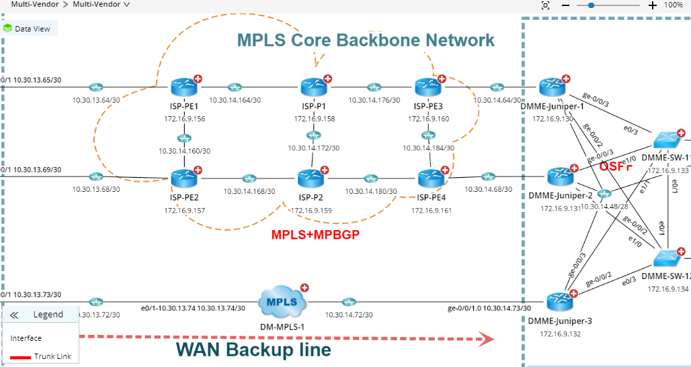

# EmbedMap Implementation in External Domain
NetBrain EmbedMap is a limited view of a regular NetBrain Map that we are using to integrate into third party software. EmbedMap only shows the map itself along with the detailed information within the visualization and the data View. There are several important use cases for EmbedMap. One use case is for low level IT staff who have little experience; EmbedMap allows for them to see the map without being overwhelmed by all the information a regular map provides. In addition, EmbedMap should be implemented so that the low experience engineers can see the map without needing credentials for their NetBrain account. Another important use case is for Just-In-Time information. We can have gather information right at the time of a network incident and display a map using EmbedMap. During the current use case, we are going to embed NetBrain map into external webpages/domains by generating an embedMap URL and set it as the source URL of an iFrame. 
<br>
EmbedMap

*Note*: Only data view and the actual map are shown
<br>
**iFrame information:**
iFrames are HTML tags that embeds another HTML page into the current one. Browsers keep the context of the iframe and its parent document totally separate by default. Neither the parent document nor the iframe document has access to each other's DOM, CSS styles, or JavaScript functions if they're not from the same domain. Each embedded browsing context has its own session history and document. Neither the iframe nor its parent can access the other's cookies or local storage. Given that iFrames are html tags, we can only implement iFrames in third-party software if they allow us to add html to their domain/website. Also, since we must generate an EmbedMap URL dynamically and use RESTful API calls to retrieve NetBrain information, the third party software must also allow these functionalities.

**[Step 1: Use case preparation](Step-1:-Use-case-preparation)**
>> 1a. Enable https on Netbrain client server<br>
>> 1b. Add external domain to Content Security Policy tag in web.config file of client server<br>

**[Step 2: Embedding Map](Step-2:-Embedding-Map)**
>> 2a. Generate URL using Netbrain RESTful API<br>
>> 2b. Input generated URL into src attribute of iFrame tag<br>

## Step 1: Use case preparation
***1a. Enable https on Netbrain client server***
> https with a proper security certificate must be enabled on the Netbrain server in order for the embedMap to display properly. This is because http content will not display on an external site with https due to many browsers' Mixed-Content policies.

***1b. Add desired external domain to Content Security Policy tag in web.config file of client server***
> The Content Security Policy tag is a security policy that only allows certain domains to display information from the server in iFrames. Domains not included in this tag will not be able to display the embedMap. (Use frame-ancestors keyword)
>Note: Content Secuirty Policy might not be supported by some of the older versions of browsers, which may cause an error.

```html
<!-- Add domain to Content-Security-Policy -->
<remove name="X-Frame-Options" />
<remove name="X-Content-Type-Options" />
<remove name="X-XSS-Protection" />
<remove name="Strict-Transport-Security" />

<add name="X-Frame-Options" value="SAMEORIGIN" />
<add name="X-Content-Type-Options" value="nosniff" />
<add name="X-XSS-Protection" value="1; mode=block" />
<add name="Strict-Transport-Security" value="max-age=31536000; includeSubDomains; preload" />
<add name="Content-Security-Policy" value="frame-ancestors https://192.168.29.10:8080 https://dev85857.service-now.com/"/>
```

## Step 2: Embedding Map
***2a. Generate URL using Netbrain RESTful API***
>The embedMap URL is in the format "https:// IP address/Domain /embedMap.html" with 5 query parameters: id (mapId), t (tenant), d (domain), maptype (int), newEmptyMap (boolean). 
Ex. https://192.168.29.10/embedMap.html?id=2ed114a0-3ccd-e0ba-0490-a7f884ec7454&amp;t=a39cf019-9663-1437-5d12-746cb85e5ea0&amp;d=dd15375c-692b-4d21-85e2-c4621a62be53&amp;maptype=1  
In order to generate the URL that displays the embedMap, we must retrieve the data for the query parameters through RESTful API.

***2b. Input generated URL into src attribute of iFrame tag***
>Set the URL into the src attribute of the iFrame, and the embedMap should display properly in the desired domain.

```html
<iframe src="https://192.168.29.10/embedMap.html?id=2ed114a0-3ccd-e0ba-0490-a7f884ec7454&t=a39cf019-9663-1437-5d12-746cb85e5ea0&d=dd15375c-692b-4d21-85e2-c4621a62be53&maptype=1" height="600px" width="1125px"></iframe>
```
<br>
<br>

Example implementation with correct server configuration
```html
<!doctype html>

<html lang="en">
<head>
  <meta charset="utf-8">

  <title>iFrame Demo Page</title>
  <meta name="description" content="iFrame Demo Page">

</head>

<body>
  <p style="text-align:center;">This is an iFrame</p>
  <iframe id= "map" src= "https://en.wikipedia.org/wiki/Main_Page" height="600px" width="1125px" style="border:0"></iframe>
</body>
</html>
```

<br>
<br>
Example implementation with incorrect server configuration
```html
<!doctype html>

<html lang="en">
<head>
  <meta charset="utf-8">

  <title>iFrame Demo Page</title>
  <meta name="description" content="iFrame Demo Page">

</head>

<body>
  <p style="text-align:center;">This is an iFrame</p>
  <iframe id= "map" src= "https://www.google.com" height="600px" width="1125px" style="border:0"></iframe>
</body>
</html>
```

<br>
Note: The reason why www.google.com is not loading is because Google has its X-Frame-Options (predecessor to Content-Security-Policy) set to SAMEORIGIN, which prevents the browser from displaying iFrames that are not hosted on the same domain as the parent page.

<br>

**Deployment in third party software examples**
<br>
*ServiceNow Ticket without EmbedMap*

<br>
<br>
*ServiceNow Ticket with EmbedMap*

